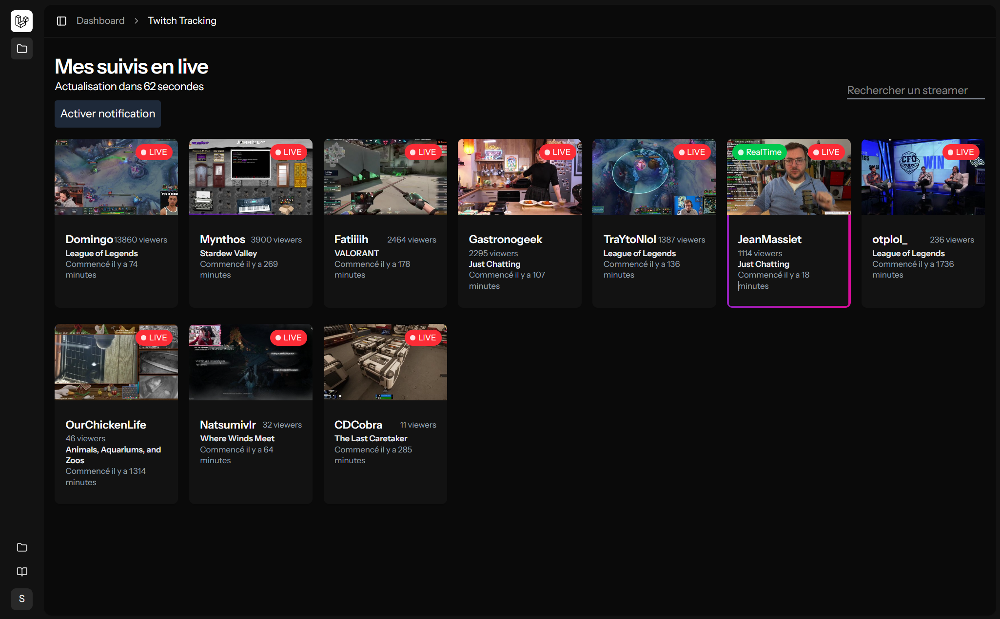
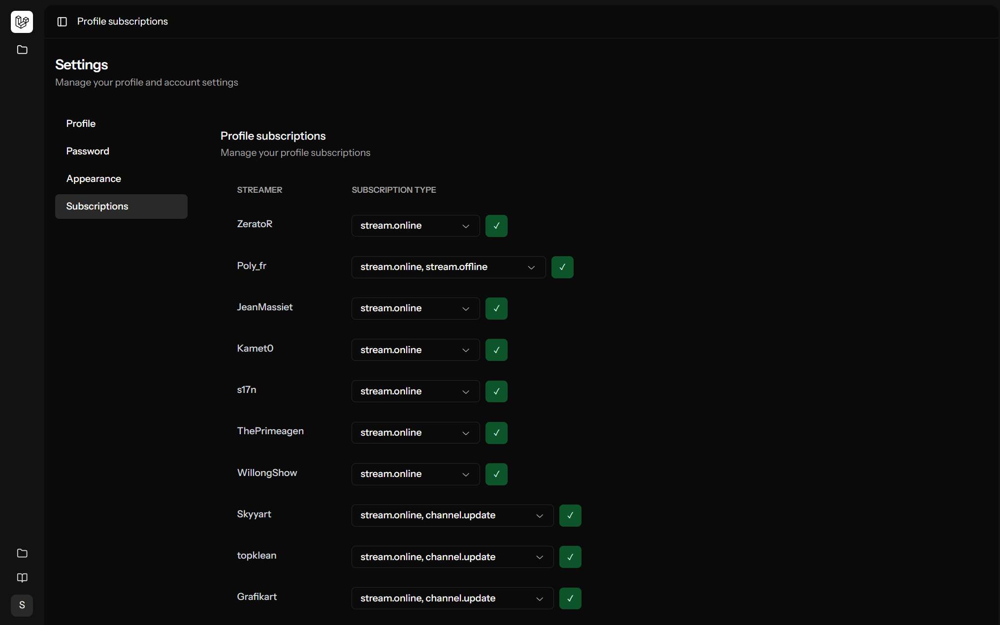

# Obsvr

A modern Laravel application for tracking and monitoring Twitch streams and events. Get real-time notifications when your favorite streamers go live, manage your subscriptions, and never miss a stream again.




## Features

- **Twitch Authentication** - Sign in with your Twitch account using OAuth
- **Stream Monitoring** - Track your favorite streamers and their activities
- **Real-time Events** - Receive Twitch EventSub webhooks for instant updates
- **Push Notifications** - Get browser push notifications when streamers go live
- **Subscription Management** - Easily manage your streamer subscriptions
- **Modern UI** - Clean, responsive interface built with Vue 3 and Tailwind CSS 4
- **Dark Mode** - Full dark mode support for comfortable viewing

## Tech Stack

### Backend
- **PHP 8.4** - Latest PHP features and performance improvements
- **Laravel 12** - Modern Laravel framework with streamlined structure
- **Laravel Octane** - High-performance application server
- **Laravel Socialite** - OAuth authentication with Twitch
- **Laravel Telescope** - Debugging and monitoring assistant
- **SQLite** - Lightweight database (easily switchable to MySQL/PostgreSQL)

### Frontend
- **Vue 3** - Progressive JavaScript framework
- **Inertia.js v2** - Modern monolith architecture with SPA feel
- **Tailwind CSS 4** - Utility-first CSS framework
- **TypeScript** - Type-safe JavaScript
- **Laravel Wayfinder** - Type-safe routing between backend and frontend
- **Reka UI** - Accessible component library
- **VueUse** - Collection of Vue composition utilities

### Development Tools
- **Pest 4** - Modern PHP testing framework with browser testing
- **Laravel Pint** - Opinionated code formatter
- **Larastan (PHPStan)** - Static analysis tool
- **ESLint** - JavaScript linter
- **Prettier** - Code formatter

## Requirements

- PHP 8.4 or higher
- Composer
- Node.js 18+ and Bun (or npm/yarn)
- SQLite extension (or MySQL/PostgreSQL)

## Installation

1. **Clone the repository**
   ```bash
   git clone https://github.com/SirMishaa/obsvr obsvr
   cd obsvr
   ```

2. **Install PHP dependencies**
   ```bash
   composer install
   ```

3. **Install JavaScript dependencies**
   ```bash
   bun install
   ```

4. **Set up environment**
   ```bash
   cp .env.example .env
   php artisan key:generate
   ```

5. **Configure Twitch OAuth**

   Register your application at [Twitch Developer Console](https://dev.twitch.tv/console/apps) and add these to your `.env`:
   ```env
   TWITCH_CLIENT_ID=your_client_id
   TWITCH_CLIENT_SECRET=your_client_secret
   TWITCH_REDIRECT_URI=http://localhost:8000/auth/twitch/callback
   ```

6. **Create database**
   ```bash
   touch database/database.sqlite
   php artisan migrate
   ```

7. **Start the development server**
   ```bash
   composer run dev
   ```

   This will start:
   - Laravel development server (http://localhost:8000)
   - Queue worker for background jobs
   - Log viewer (Pail)
   - Vite dev server for hot module replacement

   Alternatively, for high-performance development with Octane:
   ```bash
   composer run dev:octane
   ```

8. **Visit the application**

   Open your browser and navigate to [http://localhost:8000](http://localhost:8000)

## Available Scripts

### Composer Scripts

- `composer run dev` - Start all development services (server, queue, logs, Vite)
- `composer run dev:octane` - Start with Laravel Octane for better performance
- `composer run dev:ssr` - Start with Server-Side Rendering support
- `composer run test` - Run the test suite
- `composer run lint` - Run PHPStan static analysis
- `composer run helper` - Generate IDE helper files for better autocomplete

### NPM/Bun Scripts

- `bun run dev` - Start Vite development server
- `bun run build` - Build frontend assets for production
- `bun run build:ssr` - Build with SSR support
- `bun run lint` - Run ESLint and auto-fix issues
- `bun run lint:check` - Check for linting errors without fixing
- `bun run format` - Format code with Prettier
- `bun run format:check` - Check code formatting

### Artisan Commands

- `php artisan test` - Run tests
- `php artisan test --filter=testName` - Run specific test
- `php artisan wayfinder:generate` - Generate TypeScript route definitions
- `php artisan telescope:prune` - Prune old Telescope entries
- `php artisan queue:work` - Process queued jobs
- `php artisan pail` - View logs in real-time

## Testing

This project uses Pest 4 with support for unit, feature, and browser testing.

```bash
# Run all tests
php artisan test

# Run specific test file
php artisan test tests/Feature/TwitchTest.php

# Run tests with coverage
php artisan test --coverage

# Run browser tests
php artisan test tests/Browser/
```

## Project Structure

```
obsvr/
├── app/
│   ├── Http/
│   │   ├── Controllers/      # Application controllers
│   │   └── Middleware/       # Custom middleware
│   ├── Models/               # Eloquent models
│   └── ...
├── bootstrap/
│   ├── app.php              # Application bootstrap
│   └── providers.php        # Service providers
├── database/
│   ├── factories/           # Model factories
│   ├── migrations/          # Database migrations
│   └── seeders/             # Database seeders
├── resources/
│   ├── js/
│   │   ├── Pages/          # Inertia Vue pages
│   │   ├── Components/     # Vue components
│   │   └── ...
│   └── views/              # Blade templates
├── routes/
│   ├── web.php             # Web routes
│   └── console.php         # Console commands
├── tests/
│   ├── Feature/            # Feature tests
│   ├── Unit/              # Unit tests
│   └── Browser/           # Browser tests (Pest 4)
└── ...
```

## Configuration

### Twitch EventSub

To receive real-time Twitch events, you need to configure webhooks:

1. Your application must be publicly accessible (use ngrok for local development)
2. Configure EventSub subscriptions via Twitch API
3. Webhook endpoint: `POST /twitch/eventsub`

### Push Notifications

Web push notifications are configured using the `laravel-notification-channels/webpush` package:

1. Generate VAPID keys: `php artisan webpush:vapid`
2. Add the keys to your `.env` file
3. Users can subscribe via `POST /push/subscribe`

## Development

### Code Style

This project uses Laravel Pint for PHP and Prettier for JavaScript/Vue. Code is automatically formatted on commit.

```bash
# Format PHP code
vendor/bin/pint

# Format JavaScript/Vue code
bun run format
```

### Type Safety

- **PHP**: Larastan (PHPStan) ensures type safety. Run `composer run lint`
- **TypeScript**: Full TypeScript support with strict mode
- **Routes**: Laravel Wayfinder provides type-safe routes in the frontend

### Debugging

- **Laravel Telescope** - Available at `/telescope` in local environment
- **Laravel Debugbar** - Visible at the bottom of pages in development
- **Pail** - Real-time log viewer: `php artisan pail`

## Deployment

1. **Build assets**
   ```bash
   bun run build
   ```

2. **Optimize Laravel**
   ```bash
   php artisan config:cache
   php artisan route:cache
   php artisan view:cache
   ```

3. **Run migrations**
   ```bash
   php artisan migrate --force
   ```

4. **Configure your web server** to point to the `public` directory

5. **Set up queue worker** as a background process
   ```bash
   php artisan queue:work --daemon
   ```

6. **Consider using Laravel Octane** for production performance

## Contributing

1. Fork the repository
2. Create your feature branch (`git checkout -b feature/amazing-feature`)
3. Write tests for your changes
4. Ensure tests pass (`php artisan test`)
5. Format your code (`vendor/bin/pint && bun run format`)
6. Commit your changes (`git commit -m 'Add amazing feature'`)
7. Push to the branch (`git push origin feature/amazing-feature`)
8. Open a Pull Request

## License

This project is open-sourced software licensed under the [MIT license](https://opensource.org/licenses/MIT).

## Acknowledgments

- Built with [Laravel](https://laravel.com)
- UI powered by [Inertia.js](https://inertiajs.com) and [Vue.js](https://vuejs.org)
- Styled with [Tailwind CSS](https://tailwindcss.com)
- Tested with [Pest](https://pestphp.com)
